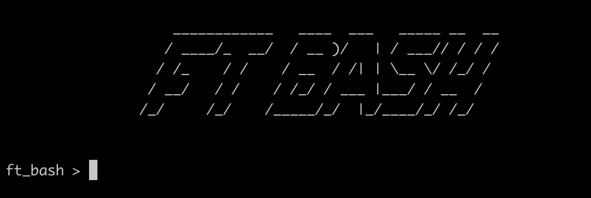
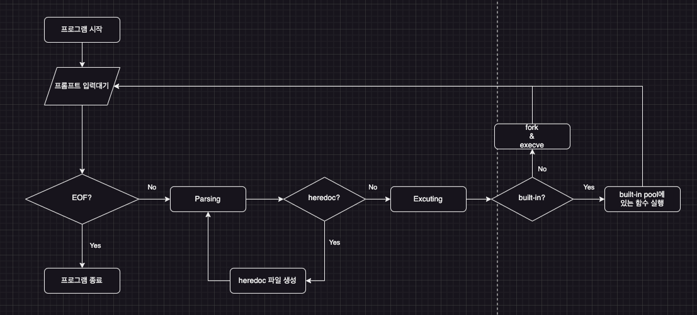

# 미니쉘 팀 프로젝트

    
    This is our Interactive-shell project!
    (from 42Cursus - Circle 3)

해당 프로젝트의 목표는 유닉스 쉘을 직접 구현해보는 것입니다! 

사용 언어 -  &nbsp;  &nbsp;

## 팀 멤버 소개 및 링크 
### 인회 
 

### 나영 
 

### 대근 
 

### 세연 
 

## 목차
- [파서 구현](#파서-구현) - 입력받은 Command로 트리를 생성 (<a href="https://pubs.opengroup.org/onlinepubs/009604499/utilities/xcu_chap02.html#tag_02_10_02">Bash Grammar Link</a>) 
- [Builtin 함수](#builtin-함수-목록들-옵션-제외) - export, cd, unset, pwd, echo, exit, env
- [트리 실행부 구현](#트리-실행부-구현---파싱된-트리를-실행) - 파싱된 트리를 실행
- [쉘 메타 문자 구현](#구현한-쉘-메타문자-목록) - $, |, ||, &&, <, >, <<, >>
- [기타 기능](#기타-기능들)
- [구현 시 유의사항 및 문제점 정리](#구현-시-유의사항-및-문제점-정리)

## 프로젝트 동작과정 (FlowChart)

## 파서 구현
- ### LL파서 구현
    - 입력된 문자열을(Command)의 왼쪽에서부터 파싱을 시작하여(좌측유도) Rule을 적용해간다
    
    - 진행중에 적용 가능한 Rule이 여러 개인 상황(비결정적인 상황)을 회피하기 위해 문법을 일부 수정하였음 (left factoring, left recursion elimination하여 모호성을 제거)
    
    - 파싱을 진행하면서 적용할 수 있는 Rule이 없는 경우 Syntax Error
        
- ### 트리 생성
    - 우리의 파서는 문법의 유효성을 검사하는 동시에 실행부에 넘겨줄 트리를 같이 생성

    - Rule rhs의 앞의 symbol이 child가 되고 뒤의 symbol이 parent가 되어, parent의 왼쪽 자식에 child가 삽입되게끔 트리를 생성하여 실행순서를 조절 
    (단)
- ### 간단한 명령어일 때, 트리 구성그림 추가
    - image.png(간단한 트리예시/ 예.ls | cat etc.)
- ### 우리가 만든 문법(Rule) img 첨부
    - image.png(문법 이미지)

 

## Builtin 함수 목록들 (옵션 제외)
    export - 환경변수 추가 및 업데이트, 갱신
    cd - 절대경로 및 상대경로를 통한 디렉토리 이동
    unset - 등록된 환경변수를 제거
    pwd - 현재 작업중인 디렉토리 표시
    echo - echo 구현(-n옵션)
    exit - 현재 프로세스를 종료
    env - 환경변수의 리스트를 출력
 

## 트리 실행부 구현 - 파싱된 트리를 실행
- 일반적인 경우, 트리의 루트에서 왼쪽부터 내려가며 각 노드들을 실행 (전위 순회 - 재귀)

- 단, 오른쪽 자식이 파일인 경우에만 오른쪽 자식을 먼저 방문(입출력 재지정시에만)

- 쉘의 메타문자별로 노드의 타입이 구분됨 (ex, pipe_type(|), input_type(<), heredoc_type(<<), etc.. )

- 메타문자 타입을 제외한 것들은 특정 파일과 혹은 명령어와 관련된 문자

 

## 구현한 쉘 메타문자 목록 $, |, ||, &&, <, >, <<, >>
- $(환경변수) : 사용자가 다음과 같이 입력 시, 저장된 환경변수로 변환

- | (Pipe) : 병렬적인 프로세스 실행을 위해 파이프를 사용하며, 파이프를 통해서 부모-자식프로세스간의 통신을 통해 명령어 및 데이터 처리

- <, >, >> (Redirect) : 프로세스의 입출력을 재지정
    - < : 프로세스의 입력 지정
    - \> : 프로세스의 출력 지정(덮어쓰기)
    - \>\> : 프로세스의 출력 지정(이어쓰기)  

- << (HereDoc) : 프로세스의 입력을 대기 받는 상태로, 표준입력을 여러줄 이어받고 싶을 때 사용

- && (And) : CMD1 && CMD2 처럼 사용하며, CMD1이 명령어 실행에 성공했을 때, CMD2를 실행(CMD1이 실행에 실패했을 때, CMD2 실행 X)
- || (Or) : CMD1 || CMD2 처럼 사용하며, CMD1이 명령어 실행에 실패했을 때, CMD2를 실행(반대의 경우 CMD1이 실행에 성공했을 때, CMD2는 실행 X)

- \*, ? (WilCard) : \*는 뒤에 몇글자가 오는지 상관없이 모든 글자가 매칭될 수 있으며, ?는 한글자만 매칭(ex, \+a == ba,?a,aaa  / ?a = ba, ca etc..)

## 기타 기능들

histroy 기능 : 사용자가 기존에 입력한 키워드(history)를 기억하여 키보드 입력(up, down)시 이전 키워드를 찾을수 있도록
환경변수 확장기능 :  (메타 문자 $)
시그널 이벤트 변경 : sigint, sigquit
quote(", ') 처리기능: quote로 감싸진 메타문자의 처리는 기존의 쉘과 동일해야함

3. 실행부의 중점

fork()와 pipe()를 이용한 프로세스 실행법과 올바른 프로세스 관리 wait()에 대해서 소개

4. 프로젝트를 진행하며 생긴 이슈들

## 구현 시 유의사항 및 문제점 정리

